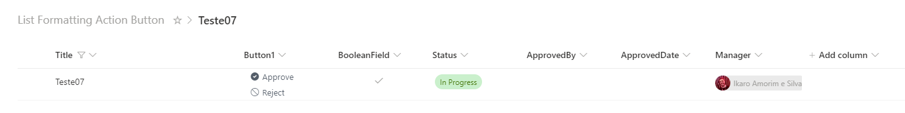

<h1 align="center">Sharepoint</h1>

 <a href="#description">Project Description</a> •
 <a href="#technologies">Technologies</a> • 
 <a href="#author">Author</a> • 
 <a href="#images">Images</a>

## 💻 Project Description

Sharepoint is a Repo to keep track of projects, tests or enven follow along tutorials related to sharepoint

## 💻 Contents

## 🛠 Technologies

The following resources are used in this project
- [Sharepoint](https://www.microsoft.com/pt-br/microsoft-365/sharepoint/collaboration?ms.officeurl=sharepoint&rtc=1)

## 👨‍💻 Author

<a href="https://www.linkedin.com/in/ikaroamorimesilva/">
 
  
 <b>Ikaro Amorim e Silva</b>
 </a>

Done with ❤️ by Ikaro Amorim e Silva

  

## 🌍 Images and Videos

   

